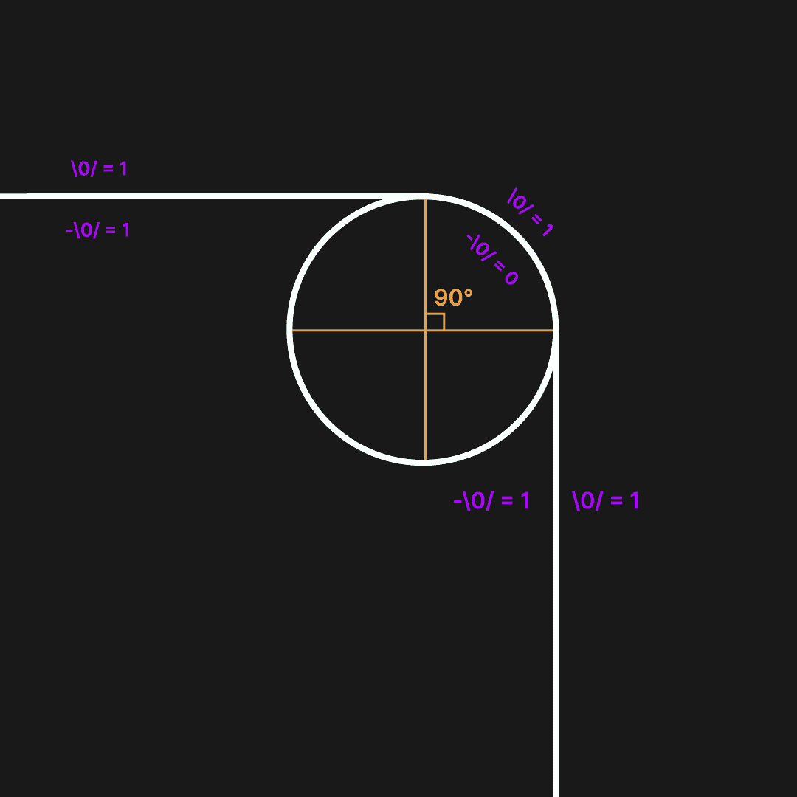

# rotatio-operators-theory
A theory describing recurring patterns at different scales through rotation operators

Hi reader! Thanks for stopping by. I hope you’re reading this in good spirits (and maybe with a cup of coffee ☕). P.S Sorry for the mistakes because this is just a draft writing

Everything I will write here are just my thoughts at this moments that will need to be proofed or discharged. The theory is based on things that everyone see and maybe feel but couldn't explain why or how. Here I will explain my thought about mathematical constants like "π" or "e" and why everywhere we see recurring patterns like circles, squares etc. Why everything in space is going round and works like it works. Why corners may not look at what they are first. Why circle is a fractal and just why everything is like it is.

I want to start with the things that started this chain. One day I was sitting and analyzing how Areas of basic shapes are calculated based on 1x1 squares. Everything made sense until I tried to understand how circle Areas is calculated and there this strange number appeared. I heard about "π" that it is irrational, infinite number without repetition sequence. I didn't keeped it in mind until this point. I started to search what it is and how it appear. Found that this is a number of how many diameters we need to close a circle by it's perimeter. So logically speaking we need 3 diameters and 0.14156.. of diameter. And I thought myself "Where this small piece of diameter go?" and after some time I tried to look at the circle in other perspective.

It says that circle is an infinite set of points equidistant from a center. For me it doesn't give anything. So I thought what if we will look at the circle as at one point that is rotating and coming back. Ok that sound more resonable for me. So point is moving by some infinite small steps. Morevore we can describe any figure of this infinite small steps but different. Ok then if we will look at the straight line we can say it just moving forward and doing nothing. We will come back to it later. But now let's imagine that we need to move dot from one point to another not by straight line, but by the arc. Now it where things starts to get weird. If we have finite size, lets say steps and we will move dot not by line but convert this steps to arc steps we won't get to the second point and we will see, that we still need some distance to complete. Ok lets check how much we have lost during arc movement. Approximately we will lose 30%. So you may say that we just need to take more steps, for example 30% to complete. No. Totally no. Moving point by more 30% of our diameter we still will have some distance to finish, ok, we will say that we need more than and adding more, but it may go up to infinite and still not reaching the second point! So this is the first level of the iceberg.

No you may say "But we get to the second point without problems and infinity is just abstraction". You tried. Let's make some digression and talk about math in whole. Why math is so good at describing things that we event didn't see? For example black hole. Because everything in our world is connected. World consist of cause and effect relationship. We can see it as a spider web where in one place we touched it and see how reaction is goind across. And math is a tool to find this cause and effect relationship and operate with them. So knowing two things we can find third thing and fourth e.t.c. So in math paradigm there is no difference between 2+2=4 or fourth-dimension if any of these can be proved. But you are still right math is abstraction but this abstraction is what we consist of and physics just occurence of this relationships. So how you can say that infinity is not real if you can imagine it and even work with it?

Now let's move forward to the second layer. Working with the infinity. Is is said, that 0.999999.. is 1 than how we just miracously losing this small piece? And so, we should not reach 1 but we doing it. Yes in math 0.9999 is 1 and I don't want to debate about this. But here another strange thing happens here. It seems like some things happens only on specific scales. Yes 0.99999 is 1 but what if we scale a little bit to that point like 0 is -∞ and 1 is ∞. Now taking 0.99999 as scaled to 99999.. don't seems to be even close to the infinity! Even more now we can add more and more number and still will be not even close. We also can say for example if we have an 1 meter of road and we will be scaled to the borders of this 1meter road we wouldn't reach the end of this road no matter how hard we tried. I don't talk about scales like atoms, etc. It's more complex. I don't want to talk about it more just gave you some idea.

Now when we have basic coneption of infinity and scales let's return to the circle. I already said, that point moving by the arc will never reach the end but we are doint it. So we can say that in some sequence equivalent to 0.9999 we just jumping through in to the second point. What give an idea that something more strange happening.

Straight in to the main part. What is the minimal rotation of a point so it will moved to the 1 of ∞ of a circle? Yes we can operate with angles and say that it is just ∞ small angle. But what is the angle? We will come back to this later but for now we can say that there are some fundamental things that rotating the point by circle. It is just exist we can't somehow describe it(maybe for now) but let's call this magic act as Rotation Operator and give it a symbol like \0/. I don't know just like it. So we can say that if on the point is acting \0/ than the point is moving by a circle. But what about a line? Than we can say that there are two of that operators, one is \0/ that is acting on point from the top and there is second operator -\0/ that is acting on the point from the bottom. Also we can say that they have a strange from 0 to 1. So if the point have \0/ = 1 and -\0/ = 0 than point will move clockwise otherwise it will move counter-clockwise. But what if \0/ = 1 and -\0/ = 1? From both side on the point are acting operators so point will move forward. You could say "Isn't it should stay in place?". No, point every infinite small time is moving forward and operators are only correcting the path of the point. With different configurations of \0/ and -\0/ in different time of point we can get any figure!

Let's try to take a turn with this operators. Firstly we need to move point straight with \0/ and -\0/ = 1. Than we need point to turn so we turning off one of the operator and point starting to move by the arc. Now, what we need to do to make a 90 degree turn? We need to make point move 1/4 of the circle and after that we again turning on the operator and what we see? We see a very smooth turn. You can say "And?". But just try to zoom out this angle and you will see that it is just a normal corner with 90 degree turn! So at right time entering and exiting circle movement we can get any angles we want! Isn't it interesting? And it is becoming more interesting if we will try to zoom to this angle to circle. What we will see? Probably just a 1/4 of a circle. But lets dive further and zoom, zoom, zoom. Abstractionally speaking we will see a very slight angle of course we couldn't see but there it is. Now when we get an angle just return to the start of this paragraph. It shows that circle is fractal movement.

Pi is irrational, (e) is irrational. I think all constants are irrational what shows connection between them. We know that any figure can bi fitted in to the circle so circle is the maximum turn and everything else its configurations. Than if we will plot e^x graph and put line between -e to e and then move point by the graph curve maybe there we also lose some of the length and we need two this lines and 0.7182.. This paragraph should be checked and tested.

From the collected data, we know that the universe appears to be flat. What is flat? Flat is just a line. What is line? Line is just an point with operators of \0/ and -\0/ = 1. So we can say that universe is trying to balance itself but there are places where operators configurations change over places making gravity and e.t.c. Thats make sense why planets are round and everything in space wants to be spiral and circle. Because in this places one of the operator is more powered and there are not others places nearby the planet which could lead to operators change. So we can say that planet wants everything around itself to rotate more circled. But on the planet every place every particle wants to make rotation by itself but another particles also want which leads to infinite number of different shapes and figures. So if a human will stay on a planet from every side there will be different konfiguration of operators but outside the earth they all in sum wants everything around to rotate around it.

Looking from this perspective we can say that black hole singularity is a place where \0/ is 1 and -\0/ is 0 because everything is concentrated in one point and it have a biggest koefficient difference and there is no other things with different configuration the point nearby the singularity will move in a circle without way to move out because only in black hole configuration \0/ and -\0/ = 1 are so concentrated in on place. So light, particle everything that goes in to it starts to rotate because even time move in circle there.

UPDATE: Experiment with the circle

I was willing to check for difference between dot movement in real live. So I made an experiment. I drawed a big circle on A3 paper and lined a diameter. Than I tooked tin rod and cutted to the diameter length. This tin rod now represent a diameter. Now, we took this rod from one point of a diameter on the circle and starting to curve it to the arc. And what we see? We have stopped on the somewhere on the halfway and didn't reach the second point of a diameter on the another end. Ok now lets put a dot on the diameter itself like a projection of the curve on the diameter. Now we see, that we still need some length to complete. Now lets take the rod and make it a length of the remainder length. Now again take the rod at the end of the previous curve and make iteration again and we will see again that we still need some length to complete. This can be over and over again and we still wont be able to reach second point. Through this experiment we can say that the projection of the curve on the diameter makes the point to not end the path by 25% approximately. And next iterations do it again and again. This sounds like a version of "Achilles and the Tortoise paradox". But in real life. So how we ending up to a second point if we will have a some small path to complete? Thats where some interesting thing coming to a place. By making a curve we made some approximations so we dont make a ideal curve but we have places where we still going straight. Let's call this noise. We creating a noise by trying to go by a circle which in sum gives us to complete a curve. And what interesting, if we will try again and again, we will make it more smoothly but still with noises so that's why we can't reach the end. Even tho if we will take the smallest cell of the reality and try to go by a curve we will still have an approximation of pi but not an ideal pi. So we can say scale is a sum of that noises and it go up to infinity. Because if pi was finite it means finite number of steps but we have infinite number. So we can say that our world is just noises of this number. Thats how discrete and infinity live together

Of course this is just a words that need to be proven. So now it's time for the formulas. And testing. But this part is under maintance.

-------
Also if you have any questions or ideas you can write through telegram: @vudyyyyyyyy

